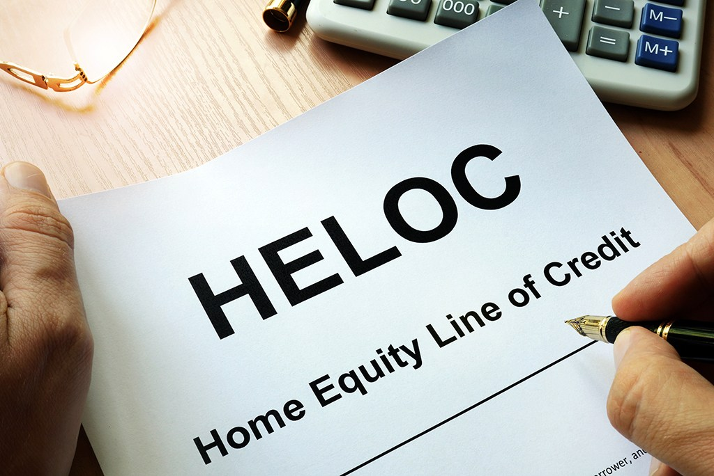

Aurubis AG (formerly Norddeutsche Affinerie AG) is the largest copper producer in Europe (the second largest in the world) and the largest copper recycler worldwide. In this project, our team aimed to improve the accuracy of predicted yield in Aurubis Buffalo. We created Tableau dashboard to explore the material and operation data and used Python to build different models and machine learning interface.

In this project I gained experience with data cleaning, feature engineering, and predictive analysis using Tableau and Python. At last, the optimal model improved about 45.7% based on the original model, and the mean square error decreased to less than 3%.

## Tableau Dashboard

Learn more about this at the [Aurubis Buffalo Manufacturing Operation Project](https://github.com/Ze-Long/Aurubis-Buffalo).
